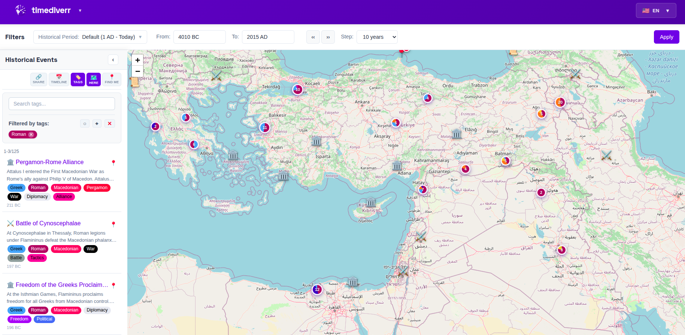

# timediverr

An interactive platform for mapping historical events on a world map. Every event has a place and a time — timediverr lets you explore both together.



## Features

- 🗺️ Interactive world map with zoom-dependent marker clustering and pie-chart cluster icons
- 📅 Timeline filtering with BC/AD support, date ranges, and historical period templates
- 🏷️ Tagging system with color coding, emoji markers, and key-color dot indicators
- 👤 Role-based authentication — see [docs/access-levels.md](docs/access-levels.md)
- 📊 Admin panel with full CRUD for events, tags, templates, datasets, regions, and users
- 📁 JSON dataset import/export with modification tracking
- 🌍 Localization (English / Russian) with reactive switching
- 🗺️ Polygonal region overlays tied to historical period templates
- 🔗 Shareable URLs that restore full filter and map state
- 📱 Progressive Web App with offline caching

## Tech Stack

- **Backend**: Go with Gorilla Mux
- **Frontend**: Vue.js 3, Vite, Leaflet
- **Database**: PostgreSQL (migrations via Goose)
- **Deployment**: Docker Compose

## Quick Start

### Prerequisites
- Docker and Docker Compose

### 1. Start services

```bash
make up
# or: docker compose up -d
```

### 2. Run database migrations

```bash
make migrate
# or: docker compose exec backend goose -dir migrations postgres \
#   "postgres://postgres:password@db:5432/historical_events?sslmode=disable" up
```

### 3. Create the first admin user

```bash
docker compose exec db psql -U postgres -d historical_events -c \
  "INSERT INTO users (username, password_hash, access_level) VALUES
   ('admin', crypt('your_secure_password', gen_salt('bf', 12)), 'super');"
```

### 4. Access the application

| Service | URL |
|---------|-----|
| Frontend | http://localhost:3000 |
| Backend API | http://localhost:8080/api |

## Available Make Commands

| Command | Description |
|---------|-------------|
| `make up` | Start all services |
| `make down` | Stop all services |
| `make build` | Build Docker images |
| `make logs` | Show service logs |
| `make migrate` | Run database migrations |
| `make db-shell` | Connect to database shell |
| `make clean` | Clean up Docker resources |

## Project Structure

```
├── backend/            # Go API server
│   ├── internal/       # Handlers, services, repositories
│   ├── migrations/     # Goose SQL migrations
│   └── main.go
├── frontend/           # Vue.js 3 SPA
│   └── src/
├── datasets/           # Historical event JSON datasets
│   ├── ancient/        # Pre-500 BC civilizations
│   └── after500BC/     # Classical period onwards
├── docs/               # Extended documentation
│   ├── access-levels.md
│   ├── api-endpoints.md
│   └── database-schema.md
├── docker-compose.yml
└── Makefile
```

## Documentation

- [User Access Levels](docs/access-levels.md)
- [API Endpoints](docs/api-endpoints.md)
- [Database Schema](docs/database-schema.md)

## Contributing

1. Use snake_case for all function and variable names
2. Follow existing code patterns and file structure
3. Keep all database changes in migration files
4. Update `replit.md` for significant architectural changes

## License

MIT — see LICENSE file for details.
